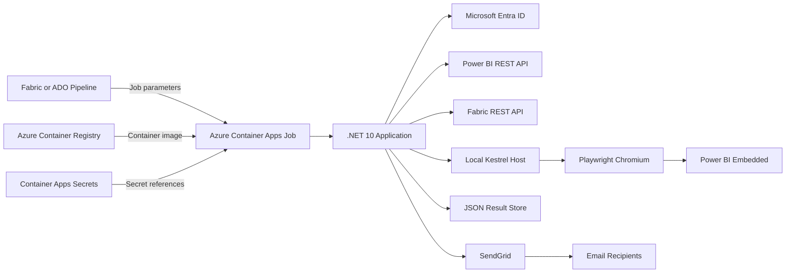

# Reports Sanity Check

## Overview and purpose

Reports Sanity Check is an automated validation application for Microsoft Power BI reports. It is intended to run after report deployments and identify reports, pages, bookmarks, visuals, and supported interactions that no longer render correctly.

The application:

- Discovers reports in a specified Power BI/Fabric workspace.
- Generates Power BI embed configurations using a Microsoft Entra service principal.
- Opens reports in headless Chromium with Microsoft Playwright.
- Checks initial rendering, report pages, bookmarks, drill-through paths, and configured toggle interactions.
- Captures report-level failures and diagnostic details.
- Sends an HTML summary through SendGrid.
- Runs as a one-time Azure Container Apps Job and returns an infrastructure/workflow exit code.

Report failures are included in the result summary but do not make the Container Apps Job fail. Exit code `1` is reserved for workflow or infrastructure failures such as invalid input, authentication failure, or inaccessible workspace.

---

## High-level architecture



### Runtime sequence

1. A pipeline starts an Azure Container Apps Job execution.
2. The job pulls the requested image from Azure Container Registry.
3. Environment variables and secret references are injected into the container.
4. The application validates the workspace ID and authenticates through Microsoft Entra ID.
5. Reports are discovered through the Power BI and Fabric APIs.
6. Embed tokens and report metadata are prepared.
7. The application briefly starts an internal Kestrel endpoint.
8. Playwright launches Chromium and loads the local headless test page.
9. Reports are checked in parallel batches.
10. Results are persisted and an email summary is sent.
11. The process exits and the Container Apps Job execution completes.

---

## Main components

| Component | Responsibility |
|---|---|
| `Program.cs` | Registers configuration and services, exposes static browser assets, and starts the one-time job runner. |
| `SanityJobRunner` | Validates runtime inputs, performs preflight checks, starts the local host, coordinates the run, logs workflow failures, and returns the process exit code. |
| `PowerBiEmbedService` | Authenticates to Microsoft APIs, discovers reports and folders, obtains report metadata, parses PBIR definitions, and creates embed tokens. |
| `ReportSanityCheckService` | Selects reports, applies report filters and limits, reconciles page/drill-through metadata, and assembles final results. |
| `HeadlessReportChecker` | Runs concurrent Playwright checks and manages the shared Chromium browser context and individual report pages. |
| `headless-check.html` | Local page loaded by Chromium to host the embedded Power BI report. |
| `powerbi-sanity.js` | Uses the Power BI JavaScript SDK to load reports and check pages, bookmarks, visuals, and browser-driven interactions. |
| `JsonFileSanityResultStore` | Stores the latest and historical JSON results in the configured application data directory. |
| `SendGridEmailNotificationService` | Builds and sends the normal run summary. Workflow failures are written to Container Apps console logs instead of email. |
| Azure Container Registry | Stores versioned application container images. |
| Azure Container Apps Job | Provides the one-time execution environment, CPU/memory allocation, runtime secrets, and execution timeout. |

### Technology stack

- .NET 10 / ASP.NET Core
- Microsoft Playwright 1.61.0
- Chromium from the Microsoft Playwright container image
- Microsoft Power BI JavaScript SDK 2.23.9
- Microsoft Identity Client
- Power BI REST API
- Microsoft Fabric REST API
- SendGrid
- Azure Container Registry
- Azure Container Apps Jobs

---

## Validation coverage

The application currently supports the following checks:

### Initial report render

- Loads each report through Power BI Embedded.
- Waits for successful rendering or a Power BI error.
- Captures visual and query errors returned by the embedded report.

### Page traversal

- Always visits visible and hidden report pages.
- Waits for each page to render.
- Limits traversal with `MaxPagesPerReport` when configured.

### Bookmark traversal

- Always applies authored bookmarks.
- Rechecks the report after each bookmark is applied.
- Uses a separate bookmark application timeout.

### Drill-through validation

- Reads drill-through page metadata from PBIR/report definitions.
- Identifies the landing page using Power BI page order and excludes it from actionable drill-through coverage.
- Uses native right-click context-menu interactions to discover and open drill-through destinations.
- Supports recursive validation up to `MaxDrillThroughDepth`.
- Deduplicates destinations already verified through another visual or bookmark state.
- Reports bound destinations as passed or unverified.
- Reports hidden pages without bound fields as informational candidates rather than failures.

### Toggle validation

- Detects configured toggle-style visuals using `ToggleVisualMatch`.
- Activates matching controls and checks the resulting report state.
- Treats unsupported or undiscoverable toggles as best-effort coverage.

---

## Setup and prerequisites

### Azure resources

The non-production environment requires:

1. An Azure subscription and resource group.
2. An Azure Container Registry containing the application image.
3. An Azure Container Apps environment.
4. An Azure Container Apps Job configured to pull the image.
5. Container Apps secrets for the Power BI client secret and SendGrid API key.
6. A pipeline or other trigger that starts the job and supplies runtime parameters.

### Microsoft Entra service principal

The application uses an app-only service principal. It requires:

- Tenant ID.
- Client/application ID.
- Client secret.
- Access to the target Power BI/Fabric workspace.
- Power BI tenant settings that permit service principals to use the required APIs.
- Permission to list reports, obtain report metadata/definitions, generate embed tokens, and read Fabric folder metadata as required by the configured discovery mode.

Do not commit the client secret to source control or place it directly in `appsettings.json`.

### SendGrid

To send summaries, configure:

- A valid SendGrid API key.
- A verified sender address.
- One or more recipient addresses.

If the API key is not configured, email delivery is skipped.

### Container image

The supplied `Dockerfile`:

- Builds the project using the .NET 10 SDK image.
- Publishes a Release build.
- Runs it using the Playwright .NET 1.61.0 image.
- Includes Chromium and its Linux dependencies.
- Listens on port `8080` for the internal headless test page.

The Playwright runtime image version must remain compatible with the `Microsoft.Playwright` NuGet package version.

---

## Configuration

Configuration is loaded from `appsettings.json` and can be overridden with container environment variables. Use the **exact environment-variable names shown below**. In standard .NET configuration, double underscores represent JSON nesting: `PowerBi__ClientSecret` overrides `PowerBi:ClientSecret`.

The application defines five short, root-level job inputs: `WorkspaceId`, `ToEmails`, `EffectiveIdentityUsername`, `EffectiveIdentityRoles`, and `MaxReportsToCheck`. These are read explicitly by `SanityJobRunner`, so they do not use the `PowerBi__` or `SendGrid__` prefix. Report discovery, page checks, bookmark checks, drill-through checks, and toggle checks are mandatory application behavior and do not have pipeline flags.

### Runtime job parameters

| Environment variable | Required | Purpose | Example |
|---|---:|---|---|
| `WorkspaceId` | Yes in deployed runs | Target Power BI/Fabric workspace GUID. | `00000000-0000-0000-0000-000000000000` |
| `ToEmails` | Recommended | Comma- or semicolon-separated email recipients. | `team@example.com;owner@example.com` |
| `EffectiveIdentityUsername` | Depends on RLS | Effective identity username used for report embedding. | `user@example.com` |
| `EffectiveIdentityRoles` | Depends on RLS | Effective identity roles supplied by the pipeline. | `Participant Security` |
| `MaxReportsToCheck` | No | Caps the number of discovered reports. `0` means all reports. | `6` |
| `PowerBi__DebugReportName` | No | Limits the run to one exact report display name, matched case-insensitively. Empty means all reports. | `Cycle Time Report` |
| `PowerBi__ClientSecret` | Yes | Microsoft Entra application secret. Use a Container Apps secret reference. | Secret reference |
| `SendGrid__ApiKey` | For email | SendGrid API key. Use a Container Apps secret reference. | Secret reference |

> **Important:** If `PowerBi__DebugReportName` does not match a report, the current implementation logs a warning and continues with all discovered reports. Verify the report name before starting a focused run.

### Key application settings and exact override names

| `appsettings.json` key | Exact container environment variable | Current role |
|---|---|---|
| `PowerBi:IncludeReportsFolder` | `PowerBi__IncludeReportsFolder` | Includes reports under the named Fabric folder and nested folders. |
| `PowerBi:ExcludeReportsFolders` | `PowerBi__ExcludeReportsFolders__0`, `PowerBi__ExcludeReportsFolders__1`, etc. | Overrides individual excluded-folder list entries by zero-based index. |
| `PowerBi:MaxParallelReports` | `PowerBi__MaxParallelReports` | Number of reports checked concurrently; constrained by the application to 1-10. |
| `PowerBi:MaxReportsToCheck` | **Preferred job input:** `MaxReportsToCheck`<br>**Direct .NET override:** `PowerBi__MaxReportsToCheck` | Report-count cap; `0` means unlimited. The short job input is preferred because `SanityJobRunner` validates and logs it explicitly. |
| `PowerBi:RenderTimeoutSeconds` | `PowerBi__RenderTimeoutSeconds` | Initial report-render timeout. |
| `PowerBi:BookmarkApplyTimeoutSeconds` | `PowerBi__BookmarkApplyTimeoutSeconds` | Timeout for each bookmark state. |
| `PowerBi:OverallTimeoutSeconds` | `PowerBi__OverallTimeoutSeconds` | Overall browser-check budget for one report. |
| `PowerBi:InteropTimeoutBufferSeconds` | `PowerBi__InteropTimeoutBufferSeconds` | Additional .NET/JavaScript interop timeout buffer. |
| `PowerBi:PageTimeoutSeconds` | `PowerBi__PageTimeoutSeconds` | Timeout for rendering an activated page. |
| `PowerBi:MaxPagesPerReport` | `PowerBi__MaxPagesPerReport` | Maximum pages checked per report; `0` means unlimited. |
| `PowerBi:MaxInteractionsPerReport` | `PowerBi__MaxInteractionsPerReport` | Caps browser-driven interactions; `0` means unlimited. |
| `PowerBi:MaxDrillThroughDepth` | `PowerBi__MaxDrillThroughDepth` | Maximum recursive drill-through depth. |
| `PowerBi:DebugReportName` | `PowerBi__DebugReportName` | Optional single-report debug filter. |
| `PowerBi:DebugDrillThroughDom` | `PowerBi__DebugDrillThroughDom` | Adds verbose drill-through DOM diagnostics; keep disabled in normal runs. |
| `PowerBi:ClientSecret` | `PowerBi__ClientSecret` | Microsoft Entra client secret; use `secretRef`. |
| `SendGrid:ApiKey` | `SendGrid__ApiKey` | SendGrid API key; use `secretRef`. |

### Naming rule for container overrides

| Setting type | Naming rule | Examples |
|---|---|---|
| Explicit root-level job input | Use the short name exactly as documented. | `WorkspaceId`, `ToEmails`, `EffectiveIdentityUsername`, `EffectiveIdentityRoles`, `MaxReportsToCheck` |
| Setting inside `PowerBi` | Use `PowerBi__` followed by the setting name. | `PowerBi__DebugReportName`, `PowerBi__MaxParallelReports` |
| Setting inside `SendGrid` | Use `SendGrid__` followed by the setting name. | `SendGrid__ApiKey` |
| Array/list entry | Add its zero-based index as another `__` segment. | `PowerBi__ExcludeReportsFolders__0` |

> **Simple rule:** use a short name only for the five explicit job inputs listed above. For every other setting, use the full `Section__Setting` environment-variable name from the table.

### Example Container Apps Job container override

```json
{
  "containers": [
	{
	  "name": "<container-job-name>",
	  "image": "<registry>.azurecr.io/reportsanitycheck:@{pipeline().parameters.ImageTag}",
	  "resources": {
		"cpu": "@{pipeline().parameters.CpuCount}",
		"memory": "@{pipeline().parameters.MemoryAmount}"
	  },
	  "env": [
		{
		  "name": "WorkspaceId",
		  "value": "@{pipeline().parameters.WorkspaceId}"
		},
		{
		  "name": "ToEmails",
		  "value": "@{pipeline().parameters.ToEmails}"
		},
		{
		  "name": "EffectiveIdentityUsername",
		  "value": "@{pipeline().parameters.EffectiveIdentityUsername}"
		},
		{
		  "name": "EffectiveIdentityRoles",
		  "value": "@{pipeline().parameters.EffectiveIdentityRoles}"
		},
		{
		  "name": "MaxReportsToCheck",
		  "value": "@{pipeline().parameters.MaxReportsToCheck}"
		},
		{
		  "name": "PowerBi__DebugReportName",
		  "value": "@{pipeline().parameters.ReportName}"
		},
		{
		  "name": "PowerBi__ClientSecret",
		  "secretRef": "azuread-clientsecret"
		},
		{
		  "name": "SendGrid__ApiKey",
		  "secretRef": "sendgrid-apikey"
		}
	  ]
	}
  ]
}
```

---

## Key workflows

### Full workspace sanity check

Use this after a deployment when all applicable reports must be checked.

1. Pass the target `WorkspaceId`.
2. Leave `PowerBi__DebugReportName` empty.
3. Set `MaxReportsToCheck` to `0`.
4. Start the Container Apps Job.
5. Monitor the job execution until completion.
6. Review the email summary for failed, timed-out, or unverified items.

### Focused single-report check

Use this while troubleshooting or validating one changed report.

1. Pass the target `WorkspaceId`.
2. Set `PowerBi__DebugReportName` to the complete report display name.
3. Start the job.
4. Confirm that the summary contains only the requested report.
5. Clear the parameter before the next full-workspace run.

Example:

```text
PowerBi__DebugReportName=Cycle Time Report
```

### Limited smoke test

Use this to confirm a new image or environment before running the full suite.

1. Leave `PowerBi__DebugReportName` empty.
2. Set `MaxReportsToCheck` to a small positive value, such as `3` or `6`.
3. Start the job and verify authentication, browser startup, report rendering, result storage, and email delivery.
4. Set `MaxReportsToCheck` back to `0` for full coverage.

`MaxReportsToCheck` selects the first N reports in discovery order. It does not select reports by name.

### Image deployment workflow

1. Build the application container image from the repository `Dockerfile`.
2. Tag the image with a unique immutable version.
3. Push the image to the target Azure Container Registry.
4. Confirm the Container Apps Job identity or registry credentials can pull the image.
5. Update the job execution/template or pipeline override to use the new image tag.
6. Run a limited smoke test.
7. Run a focused report check if required.
8. Run the full workspace check.

### Result interpretation

| Result | Meaning |
|---|---|
| `Passed` | The report completed the enabled checks without a detected rendering failure. |
| `Failed` | The report or visual returned a detected Power BI/rendering error. |
| `Timeout` | The report exceeded its configured browser-check budget. |
| `Error` | The checker encountered an unexpected browser, context, API, or workflow exception for that report. |
| Drill-through passed | A native drill-through destination was discovered, opened, and verified. |
| Drill-through unverified | Metadata identified a destination but the native interaction could not verify it. |
| Hidden candidate unverified | A hidden page was found without a bound drill-through field; this is informational. |

---

## Usage guide

### Before running

- Confirm the intended image tag exists in the registry.
- Confirm the target subscription and Container Apps Job.
- Confirm the workspace ID is a valid GUID with no trailing newline or whitespace.
- Confirm the service principal can access the workspace.
- Confirm Container Apps secrets exist and are referenced correctly.
- Confirm recipient addresses and RLS identity values are correct.
- Confirm the job replica timeout is long enough for the selected scope.

### Running all reports

Use:

```text
WorkspaceId=<workspace-guid>
PowerBi__DebugReportName=
MaxReportsToCheck=0
```

### Running one report

Use:

```text
WorkspaceId=<workspace-guid>
PowerBi__DebugReportName=<exact-report-display-name>
```

The report-name comparison is case-insensitive, but otherwise requires the complete display name.

### Running multiple specifically named reports

This is not currently supported by one parameter. Available options are:

- Run separate focused job executions, one report name per execution.
- Run all reports and apply `MaxReportsToCheck`, noting that this limits by discovery order rather than name.
- Extend the application later with a delimited report-name list parameter.

### Reviewing results

The email summary includes:

- Workspace name.
- Total, passed, and attention-required report counts.
- Start and completion timestamps.
- Run ID.
- Per-report status and slowest load.
- Page, bookmark, and interaction counts.
- Drill-through results and relevant diagnostics.

When `PowerBi__DebugReportName` is configured, additional performance diagnostics may be included for troubleshooting.

### Exit-code behavior

- `0`: The workflow completed, even if individual reports failed or timed out. Report-level failures are communicated in the result and email.
- `1`: The overall workflow failed, for example because input validation, authentication, workspace access, or setup failed.

This distinction prevents a broken report from being confused with a broken job platform or deployment.

---

## Known limitations

1. **Single named-report filter only**  
   `PowerBi__DebugReportName` accepts one report display name. A list of report names is not supported.

2. **Unmatched focused report falls back to all reports**  
   If the configured report name is not found, the application currently proceeds with the full discovered set instead of failing fast.

3. **Native interaction checks are best-effort**  
   Drill-through and custom toggle validation depend on Power BI's rendered DOM and context-menu behavior, which are not stable public automation contracts.

4. **Not every hidden page is a valid drill-through destination**  
   Hidden pages without bound drill-through fields are reported as informational unverified candidates.

5. **Authoring metadata can be inconsistent**  
   A landing page may be marked as drill-through in PBIR metadata. The application excludes the order-zero landing page from actionable destination coverage and reports the inconsistency.

6. **Folder discovery depends on Fabric API availability**  
   Folder-scoped discovery requires the Fabric REST API. If it is unavailable, behavior may fall back to the flat Power BI workspace report list, reducing folder-filter precision.

7. **Run duration can exceed the job lifetime**  
   Full checks with pages, bookmarks, drill-through, and toggles can be lengthy. A Container Apps Job replica timeout near 30 minutes can terminate Chromium and cause remaining reports to show `Target page, context or browser has been closed`. Configure sufficient job execution time, such as 60 minutes, based on measured runs.

8. **Parallelism has a resource cost**  
   Increasing `MaxParallelReports` reduces wall-clock duration but increases Chromium memory, CPU usage, concurrent Power BI load, and the chance of transient browser/resource failures.

9. **Shared browser lifecycle**  
   Reports use separate pages in a shared browser context. If the browser or container is terminated, every active report and all reports waiting in later batches are affected.

10. **Power BI service behavior and limits apply**  
	Rendering duration, capacity load, throttling, embed-token behavior, and visual query limits can affect results independently of application health.

11. **RLS configuration must match the semantic model**  
	An incorrect effective identity or role may produce misleading report output or an embed failure.

12. **Email depends on an external provider**  
	A successful report run does not guarantee email delivery if SendGrid configuration, sender verification, quota, or recipient policy blocks the message.

13. **Result storage inside a job container may be ephemeral**  
	Local JSON files do not provide durable cross-execution history unless the job mounts persistent storage or exports results to an external system.

14. **Linux headless warnings may appear**  
	DBus, Bluetooth, VAAPI, and software-GPU warnings are common in headless containers and are not automatically report failures. The final checker status and browser-closure messages are more meaningful.

---

## Operational dependencies

| Dependency | Why it is needed |
|---|---|
| Microsoft Entra ID | Service-principal authentication. |
| Power BI REST API | Workspace/report access, metadata, and embed operations. |
| Fabric REST API | Folder-aware report discovery and report-definition metadata. |
| Power BI Embedded endpoints | Actual rendering and interaction execution. |
| Azure Container Registry | Container image storage. |
| Azure Container Apps Jobs | Scheduled/on-demand one-time execution. |
| Playwright and Chromium | Browser automation. |
| SendGrid | Normal run-summary email delivery. |
| Container Apps console logs | Workflow/infrastructure errors and exception details. |
| Network/DNS access | Required for Microsoft APIs, Power BI embed endpoints, identity endpoints, registry access, and SendGrid. |

---

## Troubleshooting guide

### Job fails before browser startup

Check:

- `WorkspaceId` is present and is a valid GUID.
- `PowerBi__ClientSecret` resolves from the expected Container Apps secret.
- Tenant ID and client ID belong to the intended non-production identity.
- The service principal has access to the workspace.
- Network access to Microsoft identity, Power BI, and Fabric endpoints is available.

### No summary email arrives

Check:

- `SendGrid__ApiKey` secret reference.
- Verified SendGrid sender address.
- `ToEmails` formatting.
- SendGrid activity and suppression lists.

### Job workflow fails

Workflow and infrastructure failures are not emailed. Review the Azure Container Apps Job execution and `ContainerAppConsoleLogs` for the failed stage, exception, and stack trace. The process returns exit code `1` for these failures.

### Focused run checks every report

Check:

- The environment variable is named `PowerBi__DebugReportName`.
- The value is the complete report display name.
- Pipeline expressions resolved to a non-empty value.
- The report exists in the selected workspace and discovery folder scope.

An unmatched report currently causes the application to continue with all reports.

### Reports fail with browser/context closed

Check:

- Container Apps Job replica timeout.
- Container memory and CPU allocation.
- Whether the execution duration is close to the configured job limit.
- `MaxParallelReports` relative to available resources.
- Chromium process logs for an out-of-memory termination.

### Drill-through remains unverified

Check:

- The destination has a drill-through field configured in Power BI.
- The source visual includes a compatible field and has a data row.
- The destination is not merely a hidden navigation page.
- The landing page is not incorrectly marked as a drill-through page.
- The authored interaction works manually in Power BI using the same effective identity.

---

## Security guidance

- Keep `PowerBi__ClientSecret` and `SendGrid__ApiKey` in Container Apps secrets or Key Vault-backed secret references.
- Never place secrets in source-controlled configuration, pipeline logs, Wiki examples, or email output.
- Use separate service principals and secrets for non-production and production.
- Grant the service principal only the workspace and API access required by this application.
- Restrict who can start the job or override the image and environment parameters.
- Use immutable image tags or image digests for controlled deployments.
- Rotate credentials according to organizational policy.

---

## Recommended non-production validation checklist

- [ ] Container image exists in the non-production registry.
- [ ] Container Apps Job can pull the image.
- [ ] Job CPU and memory are adequate for configured parallelism.
- [ ] Job replica timeout is at least the measured full-run duration plus safety margin.
- [ ] Power BI client secret is configured as a secret reference.
- [ ] SendGrid API key is configured as a secret reference.
- [ ] Non-production service principal can access the target workspace.
- [ ] Workspace ID pipeline parameter resolves correctly.
- [ ] Recipient list is restricted to intended non-production recipients.
- [ ] Effective identity and roles are valid for the target semantic models.
- [ ] A limited smoke test completes.
- [ ] A focused single-report test completes.
- [ ] A full workspace test completes.
- [ ] Email formatting and report counts are correct.
- [ ] Report-level failures do not incorrectly mark the infrastructure job as failed.

---

## Future enhancements and discussion items

- [ ] Add support for multiple specifically named reports in one execution.
- [ ] Fail fast when a requested report name does not match instead of checking all reports.
- [ ] Persist results to durable Azure Storage, Log Analytics, or a database.
- [ ] Add job execution and report-duration metrics to Application Insights.
- [ ] Add deployment infrastructure as code for the registry, secrets, and Container Apps Job.
- [ ] Add explicit ADO release gates based on summary results.
- [ ] Add configurable retry behavior for transient Power BI or browser failures.
- [ ] Revisit the optimal `MaxParallelReports` value after measuring CPU and memory in non-production.
- [ ] Document ownership, support contacts, alert recipients, and escalation procedures.

---

## Source reference

The most relevant implementation files are:

- `Program.cs`
- `Dockerfile`
- `appsettings.json`
- `Services/Api/SanityJobRunner.cs`
- `Services/PowerBi/PowerBiOptions.cs`
- `Services/PowerBi/PowerBiEmbedService.cs`
- `Services/PowerBi/ReportSanityCheckService.cs`
- `Services/PowerBi/HeadlessReportChecker.cs`
- `Services/PowerBi/SanityResultStore.cs`
- `Services/Notifications/SendGridEmailNotificationService.cs`
- `wwwroot/headless-check.html`
- `wwwroot/js/powerbi-sanity.js`

---

## Document status

**Status:** Initial draft for team review  
**Target:** Azure DevOps Wiki  
**Next review topics:** non-production resource names, deployment pipeline details, scheduling/trigger ownership, job timeout, support contacts, and operational SLA.
